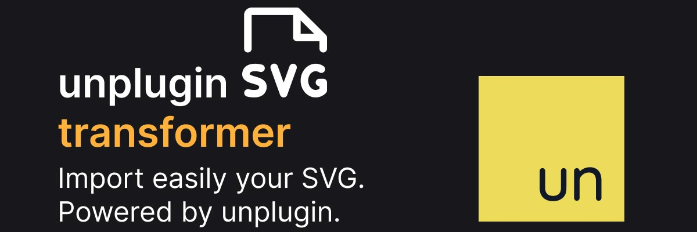

# Vite Plugin SVG

<!--  -->

[![vite][vite-version-src]][vite-version-href]

<!-- [![version][version-src]][version-href] -->
<!-- [![downloads][downloads-src]][downloads-href] -->

[![license][license-src]][license-href]
[![tests][tests-src]][tests-href]

<!-- [![codecov][codecov-src]][codecov-href] -->

EXPERIMENTAL. Import easily your SVG with Vite.

## Features

// TODO

### Roadmap

// TODO

## Install

```bash
pnpm i
```

## Installation

// TODO

## Usage

// TODO

## Testing

```bash
pnpm test
```

### Local

In `package.json`:

```json
{
  "devDependencies": {
    "unplugin-svg-transformer": "file:~/unplugin-svg-transformer.tgz"
  }
}
```

### Build

```bash
pnpm run prepublishOnly
```

```bash
pnpm run release
```

## Changelog

Please see [CHANGELOG](CHANGELOG.md) for more information on what has changed recently.

## Credits

- [Ewilan Riviere](https://github.com/ewilan-riviere)
- [antfu/unplugin-starter](https://github.com/antfu/unplugin-starter)

## License

The MIT License (MIT). Please see [License File](LICENSE.md) for more information.

[](https://github.com/kiwilan)

[vite-version-src]: https://img.shields.io/static/v1?style=flat-square&label=Vite&message=plugin&color=646CFF&logo=vite&logoColor=ffffff&labelColor=18181b
[vite-version-href]: https://www.php.net/
[version-src]: https://img.shields.io/npm/v/@kiwilan/unplugin-svg-transformer.svg?style=flat-square&color=646CFF&logoColor=ffffff&labelColor=18181b
[version-href]: https://www.npmjs.com/package/@kiwilan/unplugin-svg-transformer
[downloads-src]: https://img.shields.io/packagist/dt/kiwilan/unplugin-svg-transformer.svg?style=flat-square&colorA=18181B&colorB=646CFF
[downloads-href]: https://packagist.org/packages/kiwilan/unplugin-svg-transformer
[license-src]: https://img.shields.io/github/license/kiwilan/unplugin-svg-transformer.svg?style=flat-square&colorA=18181B&colorB=646CFF
[license-href]: https://github.com/kiwilan/unplugin-svg-transformer/blob/main/README.md
[tests-src]: https://img.shields.io/github/actions/workflow/status/kiwilan/unplugin-svg-transformer/ci.yml?branch=main&label=tests&style=flat-square&colorA=18181B
[tests-href]: https://github.com/kiwilan/unplugin-svg-transformer/actions/workflows/ci.yml
[codecov-src]: https://codecov.io/gh/kiwilan/unplugin-svg-transformer/branch/main/graph/badge.svg?token=P9XIK2KV9G
[codecov-href]: https://codecov.io/gh/kiwilan/unplugin-svg-transformer
